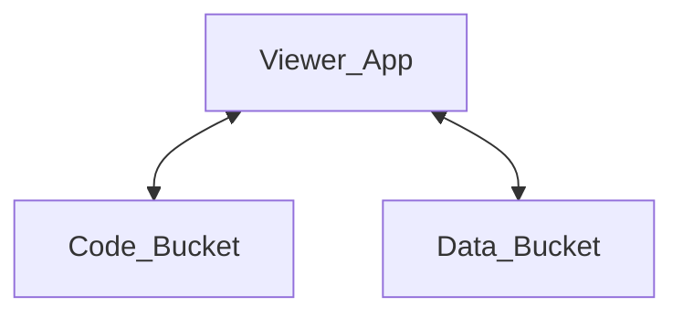

# Viewer Architecture

<figure>

<figcaption>Fig 1: A high level architecture diagram of the viewer operation</figcaption>
</figure>

The viewer is a static React application. The viewer code is served to the
client from the code bucket on initial HTTP request. After the client has the
viewer application up and running, the user is able to interact with the viewer
and the viewer application makes requests to---and fetches data directly
from---the data bucket based on user inputs.
