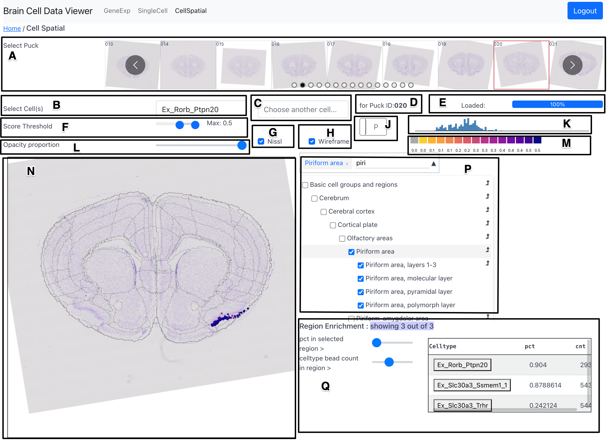

# Cell Spatial Tab

The CellSpatial tab shows a likelihood score of a celltype selected by the user
across the surface of a cross-section of the mouse brain. The user can also
select cross-sections from different available brain regions. The following
figure shows a snapshop of the CellSpatial tab, which is followed by a
description of the various components and associated functionality.

<figure>

<figcaption>Fig 1: A snapshot of the CellSpatial tab</figcaption>
</figure>

## Components

### Puck Selection Carousel (A)

The Puck Selection Carousel allows the user to select a puck (cross-section
location) from 101 availble pucks. The user can use the bubbles to jump
directly to a region of interest along the saggital axis.

### Primary Celltype Selection (B)

The primary celltype selection dropdown allows the user to select a celltype to
plot its score at sampling locations across the surface area of the selected puck on
the [Overlay Plot (N)](#overlay-plot-n).

### Secondary Celltype Selection (C)

The secondary celltype selection dropdown allows the user to select a celltype to view
its differential score with regard to the celltype selected in the primary
celltype selection component (B). When a celltype is selected in this component, a 2D
dimensional colormap is displayed in place of the initial adaptive colormap.
The vertical axis of the 2D colormap conveys score of the primary celltype
while its horizontal axis conveys the score of the secondary celltype. A
sample with high score of both celltypes would show up in the color from the
top right region of the 2d colormap.

### Puck ID Indicator (D)

Shows the ID of the currently selected puck.

### Progress Bar (E)

Shows the percent of data fetched from the server to fulfill requirement
stemming from latest selections (of puck, celltype, etc.) made by the
user.

### Score Threshold (F)

The score threshold slider allows the user to filter out beads with low UMI
count from being shown in the [Overlay Plot (N)](#overlay-plot-n). The default
value of the score thresold is set to be 0.3.

### Nissl Selection Checkbox (G)

The Nissl selection checkbox allows the user to toggle the display of the Nissl
image in the background in the [Overlay Plot (N)](#overlay-plot-n).

### Wireframe Selection Checkbox (H)

The wireframe selection checkbox allows the user to toggle the display of the
wireframe marking the boundaries of the Allen CCF regions in the overlay plot.
The boundaries shown are those marking the finest level of detail in the Allen
CCF tree of region hierarchy, or in other words - the boundaries are all of the
regions that are represented by leaf nodes in the tree.

### Histogram Selector (J)

The histogram selector allows the user to select the aggregation type in
[Global Histogram (K)](#global-histogram-k)). The aggregation can either by
`P`uckwise (this is default) or by `R`egions. If the aggregation is puckwise,
then each bar of the histogram shows the total score of that celltype per for
all pucks. If the aggregation is regionwise, then each bar of the histogram
shows the total score of that celltype in a preselected set of regions.

### Global Histogram (K)

The global histogram shows the distribution of celltype score of currently
selected celltype. There are two variations of this component, which can be
toggled using the [Histogram Selector (J)](#histogram-selector-j). The first
variation shows the distribution of score of the celltype across all pucks. The
second variation shows the distribution of score of the celltype across a set
of preselected regions. 

### Opacity Proportion (L)

The opacity proportion slider allows the user to control the opacity of the
glyphs marking the bead position and conveying the celltype score value.

### Adaptive Colorbar (M)

The range of the colorbar is automatically adjusted to the range of celltype
score in the currently selected celltype and puck.

### Overlay Plot (N)

The overlay plot shows a spatial distribution of the score of a chosen
celltype across a chosen puck. The celltype score is conveyed by a scatter plot in
spatial coordinates whose point color is scaled by the magnitude of score
at its corresponding bead. A spatial context is provided in the background by a
Nissl image of a section adjacent to the puck location and a wireframe marking
the boundaries of the Allen CCF regions at the puck location.

### Region Selector and Dendrogram (P)

The region selector allows the user to select a region from the Allen CCF and
filter out beads that lie outside the selected region. The region can be
selected either by typing the name of the region in the textbox or by checking
the checkbox corresponding to a region in the interactive dendrogram. On
selecting a parent tree, all its children are selected. 

An bent arrow glyph can be seen on the right side of each row in the
dendrogram. On clicking this glyph,  the user puck is change to that which has
the highest score of the currently chosen celltype. Also, on hovering over the
region name in the dendrogram, a short acronym version of the region name is
displayed in a tooltip format.

### Region Enrichment (Q)

The region enrichment component helps find celltypes that are highly
prevelent in a selected region (or a set of regions), while simultaneously,
being less prevelent outside the selected region. In other words, this
components helps find celltypes that are unique to a selected set of regions.

The region enrichment component provides two sliders to the user to filter out
celltypes from the table on the right side of the component. The first slider
sets the threshold for minimum percent of beads of selected celltype with cell
scores greater than 0.3 in the selected region. The second slider sets the
threshold for mininum number of beads of selected celltype with score greater
than 0.3. Together, these sliders can be adjusted to only select celltypes that
are prevelent most within a selected region but less so outside that region.

By default, the celltypes in the table are sorted in descending order of the
percent of beads of the chosen celltype inside selected region (as selected by
slider 1). The order of sorting can be changed by clicking on the header row on
the name of the field to sort by.  On hovering over the name of the celltype in
the table, a tooltip appears that shows the puck ID with the highest score of
that celltype (per the [Global Histogram (K)](#global-histogram-k)) and the row
number that tells us the order of the that celltype in the table. The name of
the celltype in table can be clicked to move to the puck that has the highest
score of that celltype.

