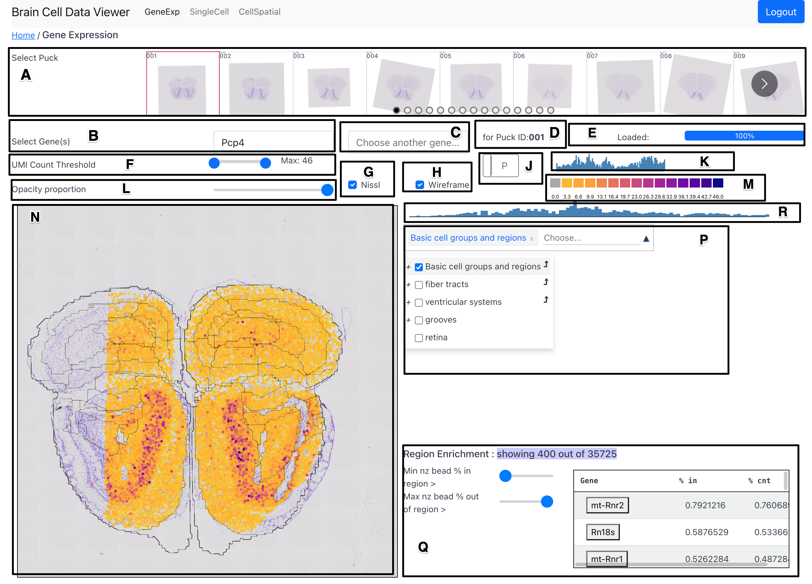

# Gene Expression Tab

The GeneExpr tab shows the expression of a gene selected by the user across the
surface of a cross-section of the mouse brain. The user can also select
cross-sections from different available brain regions. The following figure
shows a snapshop of the GeneExpr tab, which is followed by a description of the
various components and associated functionality.

<figure>

<figcaption>Fig 1: A snapshot of the GeneExp tab</figcaption>
</figure>

## Components

### Puck Selection Carousel (A)

The Puck Selection Carousel allows the user to select a puck (cross-section
location) from 101 availble pucks. The user can use the bubbles to jump
directly to a region of interest along the saggital axis.

### Primary Gene Selection (B)

The primary gene selection dropdown allows the user to select a gene to plot
its expression at sampling locations across the surface area of the selected
puck on the [Overlay Plot (N)](#overlay-plot-n).

### Secondary Gene Selection (C)

The secondary gene selection dropdown allows the user to select a gene to view
its differential expression with regard to the gene selected in the primary
gene selection component (B). When a gene is selected in this component, a 2D
dimensional colormap is displayed in place of the initial adaptive colormap.
The vertical axis of the 2D colormap conveys expression of the primary gene
while its horizontal axis conveys the expression of the secondary gene. A
sample with high expression of both genes would show up in the color from the
top right region of the 2d colormap.

### Puck ID Indicator (D)

Shows the ID of the currently selected puck.

### Progress Bar (E)

Shows the percent of data fetched from the server to fulfill requirement
stemming from latest selections (of puck, gene, etc.) made by the
user.

### UMI Count Threshold (F)

The UMI count threshold slider allows the user to filter out beads with low UMI
count from being shown in the [Overlay Plot (N)](#overlay-plot-n).

### Nissl Selection Checkbox (G)

The Nissl selection checkbox allows the user to toggle the display of the Nissl
image in the background in the [Overlay Plot (N)](#overlay-plot-n).

### Wireframe Selection Checkbox (H)

The wireframe selection checkbox allows the user to toggle the display of the
wireframe marking the boundaries of the Allen CCF regions in the overlay plot.
The boundaries shown are those marking the finest level of detail in the Allen
CCF tree of region hierarchy, or in other words - the boundaries are all of the
regions that are represented by leaf nodes in the tree.

### Histogram Selector (J)

The histogram selector allows the user to select the aggregation type in
[Global Histogram (K)](#global-histogram-k)). The aggregation can either by
`P`uckwise (this is default) or by `R`egions. If the aggregation is puckwise,
then each bar of the histogram shows the total expression of that gene per 10K
beads for all pucks. If the aggregation is regionwise, then each bar of the
histogram shows the total expression of that gene per 10K beads in a
preselected set of regions.

### Global Histogram (K)

The global histogram shows the distribution of gene expression of currently
selected gene. There are two variations of this component, which can be toggled
using the [Histogram Selector (J)](#histogram-selector-j). The first variation shows the distribution of
expression of the gene across all pucks. The second variation shows the
distribution of expression of the gene across a set of preselected regions. In
both cases, the gene expression is normalized to show expression counts per 10K
beads.

### Opacity Proportion (L)

The opacity proportion slider allows the user to control the opacity of the
glyphs marking the bead position and conveying the gene expression value.

### Adaptive Colorbar (M)

The range of the colorbar is automatically adjusted to the range of gene
expression in the currently selected gene and puck.

### Overlay Plot (N)

The overlay plot shows a spatial distribution of the expression of a chosen
gene across a chosen puck. The gene expression is conveyed by a scatter plot in
spatial coordinates whose point color is scaled by the magnitude of expression
at its corresponding bead. A spatial context is provided in the background by a
Nissl image of a section adjacent to the puck location and a wireframe marking
the boundaries of the Allen CCF regions at the puck location.

### Region Selector and Dendrogram (P)

The region selector allows the user to select a region from the Allen CCF and
filter out beads that lie outside the selected region. The region can be
selected either by typing the name of the region in the textbox or by checking
the checkbox corresponding to a region in the interactive dendrogram. On
selecting a parent tree, all its children are selected. 

An bent arrow glyph can be seen on the right side of each row in the
dendrogram. On clicking this glyph,  the user puck is change to that which has
the highest expression of the currently chosen gene. Also, on hovering over the
region name in the dendrogram, a short acronym version of the region name is
displayed in a tooltip format.

### Region Enrichment (Q)

The region enrichment component helps find genes that are highly expressed in a
selected region (or a set of regions), while simultaneously, being less
expressed outside the selected region. In other words, this components helps
find genes that are unique to a selected set of regions.

The region enrichment component provides two sliders to the user to filter out
genes from the table on the right side of the component. The first slider sets
the threshold for minimum nonzero expression inside selected region. The second
slider sets the threshold for maximum nonzero expression outside selected
region. Together, these sliders can be adjusted to only select genes that are
expressed within a selected region but not expressed outside that region.

By default, the genes in the table are sorted in descending order of the
percent of beads expressing the gene inside selected region. The order of
sorting can be changed by clicking on the header row on the name of the field
to sort by.  On hovering over the name of the gene in the table, a tooltip
appears that shows the puck ID with the highest expression of that gene (per
the [Global Histogram (K)](#global-histogram-k)) and the row number that tells us
the order of the that gene in the table. The name of the gene in table can be
clicked to move to the puck that has the highest expression of that gene.

### Region Histogram (R)

The region histogram appears when a region is selected in the [Region Selector
and Dendrogram (P)](#region-selector-and-dendrogram-p) component. It shows the
total expression of that gene per 10K beads for all pucks in the selected
region. This histogram is similar to the [Global Histogram
(K)](#global-histogram-k) showing the gene's expression across all pucks, but
has a restriction to only operate over the beads in the selected region and
ignore all remaining beads.

