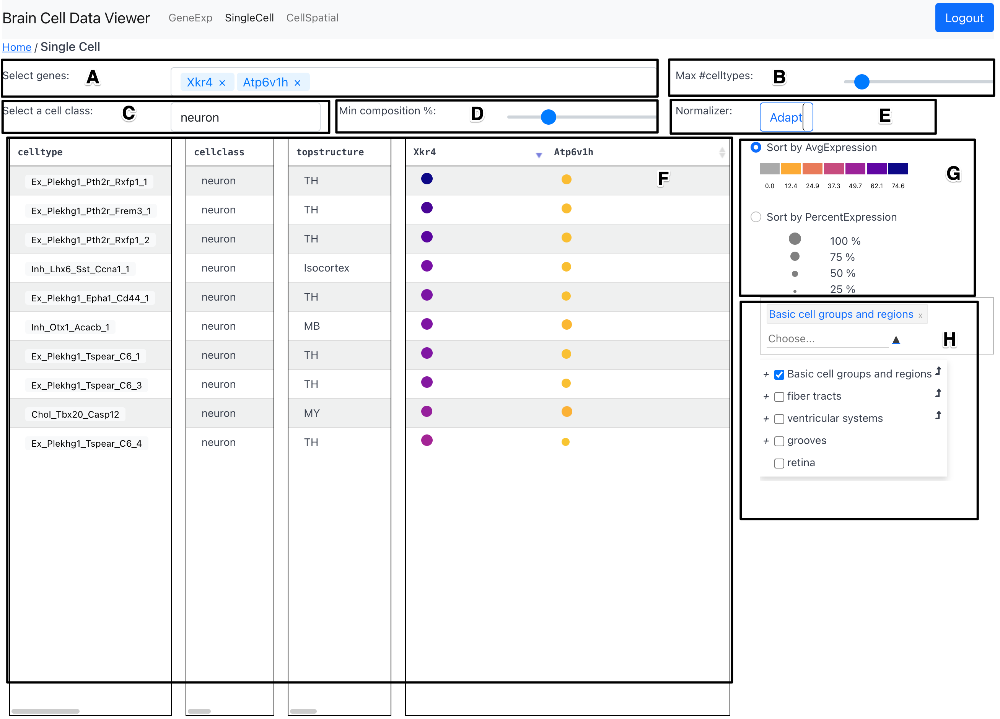

# Single Cell Tab

The SingleCell tab shows celltypes expressing a selected gene in a dotplot
format along with various filtering options to search for celltypes of
interest.

<figure>

<figcaption>Fig 1: A snapshot of the SingleCell tab</figcaption>
</figure>

## Components

### Gene Selection Dropdown (A)

The Gene Selection Dropdown allows the user to select a gene of interest to add
to the [Dotplot Table](#dotplot-table-g) showing the average and percent expression.

### Max Number of Celltypes slider (B)

The max number of celltypes slider allows the user to select the maximum number
of celltypes that are displayed in the [Dotplot Table](#dotplot-table-g). 

### Cell Class Selection Dropdown (C)

The Cell Class Selection Dropdown allows the user to restrict the celltypes
shown in the [Dotplot Table](#dotplot-table-g) to a specific cell class.

### Min composition percent slider (D)

The min composition percent slider allows to filter out celltypes that have a
low percent of cells expressing the chosen gene.

### Type of Normalizer Toggle Button (E)

This toggle button allows the user to select the type of normalization for the
dots in the [Dotplot Table](#dotplot-table-g). The options are: `Adapt` and
`Fix`. The `Adapt` option will map the size of dots to span the range of the
values currently shown in the [Dotplot Table](#dotplot-table-g). On the other
hand, the `Fix` option will map the size of dots to span the range of the
values in the entire data---regardless of whether they are currently selected
to be shown in the table based on various filtering options.

### Dotplot Table (F)

The dotplot table shows the average and percent expression of the selected gene
for each celltype in the form of a dotplot. The average expression is conveyed
using color of the dots and the percent expression is conveyed using the size
of the dots. The range of values mapped to the colormap as well as the range of
values mapped to the size of the dots is dynamically updated based on the data
as well as the user preference indicated in [Sort-by Toggle Buttons
(G)](#sort-by-toggle-buttons-g).

In the `celltype` column, a subset of celltypes for which spatial mappings are
currently available can be clicked to view the spatial distribution of that
celltype in the `CellSpatial` tab. 

In addition columns for celltype and genes, in the table, two additional
columns `cellclass` and `topstructure` convey a cell class and top level
structure with regard to Allen CCF for each celltype.

The sorting order of the celltypes in the dotplot table can be interactively
changed by clicking on a gene name in the header row. The sorting order can be
reversed by performing the click again.

On hovering over a dot, a tooltip will appear that shows the exact values of
average expression and percent expression for that gene and celltype. An
unlimited number of genes can be added to the table using the [Gene Selection
Dropdown](#gene-selection-dropdown-a). In case the number of genes selected
exceeds the capacity of the table to stack horizontally, horizontal scrolling
can be used to view the dotplots for genes that are selected but not currently
visible.

### Sort-by Toggle Buttons (G)

The sort-by toggle buttons allow the user to sort the celltypes in the [Dotplot
Table](#dotplot-table-f) by either `average expression` or `percent expression`
of the selected gene. The range of values mapped to the colormap as well as the
range of values mapped to the size of the dots is dynamically updated based on
the data as well as the user preference indicated in [Sort-by Toggle Buttons
(G)](#sort-by-toggle-buttons-g)

### Region Selector and Dendrogram (H)

The region  selector and dendrogram allows the user to restrict the celltypes
shown in the [Dotplot Table](#dotplot-table-f) to a specific region of
interest. The selected region in this component is preserved on switching
across tabs---`GeneExp` and `CellSpatial`.

